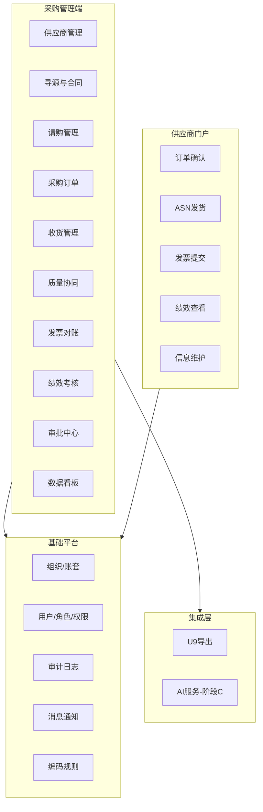

# SRM 系统建设方案

> 版本：草案 v1.7.0  
> 说明：业务闭环优先，AI 分阶段实施；执行与协同以 SRM 为准，U9 以导入/后续接口入账。  
> **v1.7.0**：将阶段 **B** 拆分为 **B-1（近期）** 与 **B-2（中期）** 并给出 **WBS 与预估工期**；补充 **§3.5～3.6**（供应商全生命周期、质量协同）、**§4.2** 模块架构图；**§2.1/§2.2** 与代码落地进度对齐（PR/审批/绩效/发票等）。  
> **v1.6.0**：在 v1.5.0 基础上，按甄云等主流 SRM 的**域分层**（供应商 / 寻源 / 协同 / 质量 / 结算 / 分析 / 系统）细化对标表与差距说明，便于评审排期。

---

## 1. 建设目标

- 建设一套**企业级 SRM**，在**能力域划分、交互习惯与协同节奏**上**对标甄云等主流 SRM**（工作台、主数据、采购协同、审批、门户协同等），**首期以业务闭环可上线**为第一目标；**不追求与商业产品功能逐项一致**，以本方案分阶段范围与 U9 集成为准。
- **执行与协同以 SRM 为准**；用友 **U9 V6.6（私有化）** 通过**导入**完成入账，**后续**再考虑接口/客开深化。
- **AI 能力**在业务闭环稳定后分阶段引入（智能助手、OCR、比价与合同辅助等），坚持**人机协同、可审计**。

---

## 2. 业务范围与边界

### 2.1 首期闭环（必须交付）

| 域 | 范围 |
|----|------|
| 组织 | **4 工厂**、各工厂**多仓库**、**4 个采购组织**；**单独核算**与 U9 对齐为 **账套 + 组织** |
| 约束 | **禁止跨工厂 PO**（同一 PO 头/行归属同一账套+组织） |
| 主数据 | 供应商、物料、仓库、币种/税/单位等（SRM 为执行侧权威，与 U9 编码对齐靠映射与导入） |
| 执行 | **PO 在 SRM 创建**；供应商**订单确认**；**ASN**；**收货在 SRM**（按仓库，勾 PO/ASN） |
| 编号 | **SRM 采购订单号 = 导入 U9 的采购订单号**（统一编码规则，避免与 U9 历史号段冲突） |
| 权限 | 按**采购组织/工厂**隔离；供应商门户仅能看**授权范围内**单据 |
| 导出 | **PO、收货分文件**：**采购订单一个文件、采购收货一个文件**；每个文件 **仅 1 个 Sheet**（不分 Sheet） |
| MVP 验收口径 | **PO 通过手工录入或 Excel 导入** 创建仍为 **MVP 主验收路径**；**请购（PR）、可配置审批实例、供应商绩效、对账/发票登记** 等已在工程中 **部分落地**（属 **阶段 A 增强 / 阶段 B-1**），**不替代** §3.2 七步闭环的必验口径；深化与贯通按 **§5.3 WBS** 与开发计划 **§0.2** 排期验收 |
| 审批 | **四工厂共用同一套审批矩阵**（金额/品类等规则一致，数据仍按组织隔离） |
| U9 导入幂等 | **重复单号拒绝**：U9 与 SRM 约定对已存在单号不再导入；SRM 侧记录导出与回写状态，避免重复推送冲突 |
| 门户认证 | **暂不实施强认证**（短信/证书等）；基础账号密码 + HTTPS，后续可按安全要求升级 |
| AI | **阶段 C 采用公有云 API**（需脱敏、合规评估与可关闭开关） |

### 2.2 阶段 B 范围拆分（B-1 近期 / B-2 中期）

> **阶段 B** 不再笼统表述为「二期」，而是拆成两段，便于排期与对标甄云套件。**B-1** 侧重「敏捷协同」补强与运营体验；**B-2** 侧重「智慧寻源」与数据中台最小集、U9 对账闭环。

**阶段 B-1（近期，约 4～6 周，可与 MVP 稳定后并行迭代）**

- **供应商全生命周期**：准入审核 → 合格/临时 → 年审 → 整改 → 淘汰；状态机 + 门户自助注册（对标甄云供应商域最小集）。
- **审批引擎接入业务**：PR/PO 提交或关键动作 **自动创建审批实例**；通过/驳回 **回写单据状态**（与「审批中心」理念一致）。
- **工作台 / 管理驾驶舱（最小集）**：待办与关键指标卡片（待审批、订单金额、收货进度、发票待处理等）；详见开发计划与 **Dashboard** 相关任务。
- **消息与通知中心**：站内消息 + 待办聚合；供应商侧新 PO、ASN 等到期/待办提醒（可选扩展邮件/企微）。
- **质量协同基础**：质检记录、不合格品处理、供应商整改单（8D/索赔深度化属 B-2/C 择优）。
- **门户与安全加固**：Portal 会话与供应商上下文一致；`SecurityConfig` 由联调宽松过渡到 **会话 + 角色** 的生产口径。

**阶段 B-2（中期，约 6～8 周）**

- **寻源（RFQ）**：发布 → 供应商报价 → 评标 → 定标（对标智慧寻源最小可行）。
- **合同台账**：合同头行、状态、关联供应商/物料、价格约束与到期预警（电子签章属扩展项）。
- **报表增强**：采购金额趋势、供应商份额、交期达成率、价格波动等主题（对标数据中台最小集）。
- **U9 导入结果回写**：解析回传文件或中间表/接口，更新导出与对账状态，形成入账闭环（依赖 **R2** 落地方式）。

**仍主要放在阶段 C 或按需单独立项**

- **复杂招投标 / 竞价大厅**、**合同全生命周期 + 电子签**、**风险评级塔**、**甄云级全量质量云（完整 8D/索赔链）**、**采购商城** 等。
- 与 U9 **实时 ERP 集成**（非导入主路径）；**AI 全部能力**（见 **§5.4** 与 **附录 B**）。

### 2.3 与甄云 SRM 的对标方式（原则）

| 维度 | 对标内容 | 本项目取舍 |
|------|----------|------------|
| **信息架构** | 工作台、主数据、采购执行、协同门户、系统管理 等一级导航 | 管理端/门户 **菜单域对齐**，具体子菜单随阶段发布 |
| **协同主链** | PO → 供应商确认 → ASN → 收货 → 对账/入账前导出 | **与 §3.2 一致**；入账以 **U9 导入** 为主 |
| **管控** | 组织/数据权限、审批、审计 | **多采购组织隔离** + **统一审批规则模型** + **审计留痕**；审批深度按阶段扩展 |
| **体验** | 列表/详情/状态标签、关键操作路径短 | 前端 **统一壳层与组件规范**（类甄云工作台风格），不绑定特定商业皮肤 |
| **不做承诺** | 甄云全部模块（寻源/合同/质量云等） | 仅将 **附录 C** 作为路线图，避免范围失控 |

### 2.3.1 甄云类产品常见域分层（参照，非商标绑定）

> 以下命名综合公开资料中甄云 SRM 常见表述（供应商管理、智慧寻源、敏捷协同等），用于**本方案内**统一沟通语言；**不表示**与任一商业产品版本逐项一致。

| 域 | 典型内容（行业常见） | 本项目阶段 |
|----|----------------------|------------|
| **工作台 / 待办** | 待审批、待确认、待收货、异常预警 | **A**：首页/列表入口；**B-1**：看板指标 + 待办聚合（§5.3 B1-3/B1-4） |
| **供应商管理** | 档案、准入认证、分级、风险、绩效 | **A**：档案 + 授权组织；**B-1**：全生命周期状态机（§3.5、B1-1）；绩效已部分落地，深化归 B-1 |
| **智慧寻源** | 询报价、招投标、价格库、合同 | **B-2**：RFQ、合同台账（B2-1/B2-2）；招投标大厅等 **非默认** |
| **敏捷协同** | 请购/需求、订单协同、送货（ASN）、收货、结算与发票 | **A**：PO→确认→ASN→收货→导出；**A 增强/B-1**：PR、对账/发票、审批贯通、消息（部分已落地） |
| **质量协同** | IQC、索赔、8D、追溯 | **B-1**：质检 + 不合格 + 整改（§3.6）；**B-2/C**：8D/索赔/追溯深化 |
| **采购商城 / 电商** | 目录化采购、电商对接 | **不做**（首期）；若未来需要单独立项 |
| **分析 / 数据中台** | 多维度分析、管理驾驶舱 | **A**：执行类最小报表；**B-2**：主题分析与管理看板扩展（§5.3 B2-3） |
| **系统管理** | 组织、用户角色、审计、集成监控 | **A**：RBAC、审计、组织建模；**B**：集成任务监控等 |

### 2.3.2 体验对齐要点（类甄云式，可验收）

- **导航**：一级域清晰（主数据、采购执行、协同相关、系统），避免功能堆叠在同一菜单。
- **列表**：状态用色块/标签区分；支持组织维度切换；关键字段固定左列（单号、供应商、日期、金额）。
- **详情**：头信息 + 行表分区；主操作（提交、审批、发布、关闭）集中在页头操作区。
- **门户**：供应商侧以「待我处理」为第一视角（待确认订单、ASN、发票等），与管理端「我发起的」形成对称表述。
- **空状态与错误**：导入/导出失败给出**可复制的错误明细**，贴近运营类 SRM 的可运维性。

### 2.4 不做或慎做

- 跨工厂合并 PO。
- 无审批、无审计的「自动授标/自动定稿合同」（AI 阶段也禁止替代审批）。

---

## 3. 核心业务方案

### 3.1 组织与数据隔离

- 实体：**账套**、**组织**、**采购组织**（与工厂采购部对齐，通常 1:1）、**仓库**（隶属工厂/组织）。
- 单据强制携带：**账套编码、组织编码**；PO/收货行携带 **仓库**。
- 数据权限：内部用户默认仅本采购组织（可配集团角色）；供应商账号绑定 **供应商 + 可协作组织列表**。

### 3.2 业务流程（闭环）

1. 主数据维护（供应商、物料、仓库、映射表）。
2. 创建 **PO**（**MVP：手工或 Excel 导入**；不含请购转单）。
3. 审批（**全集团统一审批矩阵**，各工厂相同规则；单据仍归属本工厂组织）。
4. 发布至 **供应商门户** → **订单确认**（数量、交期、备注）。
5. 供应商提交 **ASN** → SRM 校验与 PO/行状态更新。
6. 仓库执行 **收货单**（按 PO 行，可选勾 ASN），支持分批、关闭规则。
7. **导出**：**PO → 独立单 Sheet 文件**，**收货 → 独立单 Sheet 文件**；分别记录导出批次与状态；**后期由 U9 回写导入结果**至 SRM，形成对账闭环。

### 3.3 关键规则

- **数量**：累计收货 ≤ 规则允许（含可配置超收比例）；ASN 与 PO 单位、料号一致性强校验。
- **PO 变更**：修订版本号；协同与收货挂**当前有效版本**。
- **单号**：在「账套+组织」作用域内唯一；建议 **带工厂/组织前缀**（如 `F1-PO2026-000123`），由 SRM 统一发号；导入 U9 时 **不以 U9 重编号**。

### 3.4 与 U9 的衔接

- **导入对象**：采购订单、采购收货（及按需主数据）。
- **文件形态**：**采购订单、采购收货各生成一个导入文件**；**每个文件仅含一个 Sheet**（不分 Sheet、不在同一工作簿多 Sheet 混装两类单据）。
- **对照关系**：见本文 **附录 A**；取得真实 Excel 表头后冻结《导入映射说明书》。
- **重复单号**：约定 U9 导入时对 **已存在单号拒绝**；SRM 发号保证在「账套+组织」内唯一，并与历史号段隔离。
- **导入结果回写（后期必做）**：U9 侧导入完成后，将 **成功/失败、U9 单号（若与外部号一致可校验）、时间、错误信息** 等回写 SRM（方式：**Excel 回导、中间表或接口**，实施时选定），更新 SRM **导出批次/单据对账状态**，避免重复导入与状态不清。

### 3.5 供应商全生命周期管理（阶段 B-1）

> 对标甄云「供应商管理」中的 **准入 → 档案 → 能力 → 年审/考察 → 绩效 → 整改 → 淘汰** 主链条；本期以 **可运营的状态机 + 审计** 为目标，不追求与商业产品逐项一致。

- **准入与注册**：新供应商门户自助注册或采购代录 → 资质材料 → **准入审核**（通过/驳回/补件）。
- **状态分级**：例如 **候选、临时合格、合格、暂停、淘汰** 等（具体枚举以产品定稿为准）；与 **采购组织授权**、门户可见范围联动。
- **年审与现场考察**：计划任务或手工发起；结论写入档案与状态。
- **整改与淘汰**：绩效或质量触发的 **整改单**；逾期未闭环或重大风险 → **暂停/淘汰**，并限制新 PO/协同。
- **与主数据关系**：供应商 **主数据（A2）** 为执行侧权威；生命周期状态为 **管控维度**，不替代 U9 侧供应商主档同步策略。

### 3.6 质量协同方案（阶段 B-1 基础 / B-2 深化）

> 对标甄云「敏捷协同」中的 **质量协同** 子域：先落地 **记录 + 处理 + 整改**，**8D、索赔、完整追溯** 按行业要求分期。

- **质检记录**：来料或库内检验结果登记（合格/不合格、批次/数量、检验人、时间）；与 **PO/收货行** 可选关联。
- **不合格品处理**：隔离、让步、退货等处置意见与状态；通知相关采购与供应商门户（与 **§2.2 B-1 消息** 协同）。
- **供应商整改单**：要求供应商提交原因分析与纠正措施；采购确认闭环；可与 **绩效扣分** 联动（B-1 择优）。
- **深化（B-2/C）**：8D 结构化模板、索赔金额与账务协同、条码/批次级追溯等 **单独立项**。

---

## 4. 应用架构（逻辑）

- **Web 端**：采购/仓库/管理端。
- **供应商门户**：独立子域或独立应用，与内网隔离加固。
- **集成服务**：导出任务、文件生成、调度与重试。
- **数据库**：事务库；附件走对象存储。
- **后续 AI 服务**：调用**公有云大模型 / OCR 等 API**（阶段 C）；独立网关层做 **脱敏、审计、限流与开关**；与业务库权限隔离。

### 4.1 技术选型（已定）

| 层次 | 选型 | 说明 |
|------|------|------|
| 后端 | **Java**，**Spring Boot 3**（建议 **JDK 17 或 21**） | REST API、事务、权限、异步导出；API 建议 **OpenAPI** 文档 |
| 前端 | **Vue 3** + **TypeScript**，**Vite** 构建 | **管理端** 与 **供应商门户** 为 **独立 Git 仓库**（分仓），同技术栈；分别构建、分别部署（域名隔离） |
| 数据库 | **MySQL 8**，**utf8mb4** | 事务库；核心表对 **账套、采购组织** 建索引，支撑数据权限过滤 |
| 建议配套 | **Redis**；**对象存储**（MinIO / 云 OSS） | 会话与缓存、附件元数据外存；导出任务状态可落库 + 缓存 |

### 4.2 系统模块架构（对标甄云四大套件的本地化映射）

> 用于评审与排期沟通：**管理端**、**供应商门户**、**基础平台**、**集成层** 边界清晰；与 **§2.3.1 域分层**、**§5.3 阶段 B WBS** 一致。

---

## 5. 研发任务与顺序

### 5.1 原则

**先做业务闭环，再做 AI。**

### 5.2 阶段 A：业务闭环 MVP（优先）

| 序号 | 模块 | 主要交付 |
|------|------|----------|
| A1 | 基础平台 | 用户、角色、权限、组织/账套/仓库建模、审计日志 |
| A2 | 主数据 | 供应商、物料、仓库、U9 映射编码维护、主数据导入（可选） |
| A3 | 采购订单 | PO 头行、状态机、变更/修订、附件、审批流 |
| A4 | 供应商门户 | 登录、**PO 查询与确认**、**ASN 提交与查询**（与 §3.2 闭环一致）；可选公告/待办（最小实现可后置） |
| A5 | ASN | 创建、与 PO 行校验、列表与状态 |
| A6 | 收货 | 收货单、分批、关行/关单、与 PO/ASN 关联 |
| A7 | 导出 | **PO 单文件单 Sheet** + **收货单文件单 Sheet** 两种 U9 模板；批次记录、错误日志；**MVP 无自动回写前**：单据 **导出状态**（未导出/已导出/失败重试等）需可运营；表结构预留 **导入结果回写** 字段 |
| A8 | 报表 | 按工厂/仓库/供应商的执行报表（最小集） |

**里程碑**：单工厂端到端跑通 → 四工厂配置复制联调 → U9 导入联调（测试账套）。

### 5.3 阶段 B：增强业务（闭环之后）— WBS

> **与甄云常见模块的对应关系**见 **附录 C**；下表为 **工作分解 + 建议工期**（人天为粗估，随人力与并行度调整）。详细任务勾选见 **开发计划 §0.2、§7**。

**阶段 B-1（近期，约 4～6 周）**

| 编号 | 工作包 | 主要交付 | 建议工期 |
|------|--------|----------|----------|
| B1-1 | 供应商全生命周期 | 准入审核、合格/临时/暂停/淘汰等状态机；门户自助注册；审计与授权联动 | 3～4 周 |
| B1-2 | 审批引擎接入业务 | PR/PO 关键动作触发 `startApproval`；通过/驳回回调更新单据状态；与审批中心 UI 一致 | 约 1 周 |
| B1-3 | 工作台 / 看板 | 待审批数、本月订单金额、待收货、待处理发票等卡片；待办与快捷入口；`/api/v1/dashboard/stats` 类聚合接口 | 1～2 周 |
| B1-4 | 消息与通知中心 | 站内消息、待办聚合；供应商新 PO/ASN 等提醒（邮件/企微可选） | 约 2 周 |
| B1-5 | 质量协同基础 | 质检记录、不合格处理、供应商整改单（与 §3.6 一致） | 约 3 周 |
| B1-6 | Portal 与安全加固 | 会话属性与供应商上下文统一；`SecurityConfig` 生产口径收紧 | ≤3 天 |

**阶段 B-2（中期，约 6～8 周）**

| 编号 | 工作包 | 主要交付 | 建议工期 |
|------|--------|----------|----------|
| B2-1 | 寻源（RFQ） | 发布、报价、评标、定标；最小可行询报价闭环 | 5～6 周 |
| B2-2 | 合同台账 | 合同头行、状态、关联供应商/物料、价格约束、到期预警 | 3～4 周 |
| B2-3 | 报表增强 | 金额趋势、份额、交期达成、价格波动等主题报表/图表 | 2～3 周 |
| B2-4 | U9 导入结果回写 | 回传解析、批次/单据状态更新、失败字典；对账闭环（依赖 R2） | 视接口形态 2～4 周 |

**横切与优化（贯穿 B-1/B-2）**

- **导出优化**：增量导出（仅未成功入账）、失败重试与运营明细（与 A7、R2 衔接）。
- **对账/发票深化**：三单匹配规则、对账单按期间 **自动汇总** PO/GR/发票（与结算域迭代一致）。

### 5.4 阶段 C：AI（业务稳定后）

| 序号 | 模块 | 说明 |
|------|------|------|
| C1 | 知识库 + 采购助手 | 制度/手册 RAG，流程与单据问答 |
| C2 | OCR | 证照、报价单等结构化（人审后生效） |
| C3 | 合同辅助 | 条款对比、关键字段抽取（法务参与规则） |
| C4 | 寻源/执行辅助 | 比价摘要、ASN/收货异常说明、管理 NLQ（按需） |

**原则**：AI 不自动替代审批；采用**公有云 API** 时须做 **PII/价格等脱敏**、留痕与可关闭；全链路审计；通过信息安全与合规评估后上线。

---

## 6. 非功能需求（摘要）

- **安全**：门户 HTTPS、密码策略、接口限流、越权测试（供应商不可见他人 PO）；**MVP 不强认证**，后续可叠加 MFA 等。
- **性能**：导出大批量异步任务；列表分页与索引。
- **可用性**：关键操作确认与撤销策略（按业务定）。
- **可维护性**：配置化审批与编码规则；环境分测试/生产。

---

## 7. 已决策事项（摘要）

| 项 | 决策 |
|----|------|
| 与甄云关系 | **参照**甄云等主流 SRM 的域划分与体验；**不承诺**功能逐项对等，以 **附录 C** 与 **§2.2 B-1/B-2、§5.3 WBS** 为准 |
| MVP 与请购 | **MVP 验收**仍以 §2.1 **PO 主链** 为主；**PR、审批实例、绩效、对账/发票** 等已在代码中 **部分落地**，完整贯通与体验归 **阶段 B-1**（见 §2.1、§5.3、开发计划 §0.2） |
| 阶段 B 排期 | **B-1（近期）** 与 **B-2（中期）** 拆分执行，工期见 **§5.3**；不一次性承诺附录 C 全量能力 |
| 审批矩阵 | **四工厂相同矩阵**（统一规则） |
| U9 导入文件 | **PO、收货各一个文件**；**每文件单 Sheet**（不分 Sheet） |
| 重复单号 | **拒绝**（U9 与 SRM 约定；SRM 发号 + 状态管理） |
| 导入结果 | **后期回写**至 SRM（成功/失败与错误信息），支撑对账 |
| 门户认证 | **暂不强认证** |
| 供应商门户 | **含 ASN**（提交与查询，与订单协同同一闭环） |
| AI | **公有云 API**（脱敏 + 合规 + 可关闭） |
| 代码仓库 | **分仓**：**后端**、**管理端前端**、**门户前端** 各 **独立 Git 仓库**（与 §4.1 一致） |

## 8. 仍待确认事项

| 编号 | 事项 | 说明 |
|------|------|------|
| R1 | U9 **导入模板最终列名** | 拿到 Excel 表头后更新附录 A 并冻结《导入映射说明书》（**PO 文件、收货文件各一份模板**） |
| R2 | **回写导入结果**的落地方式 | Excel 回导 / 数据库中间表 / 接口（与 U9 实施方共同确定） |
| R3 | **收货单号（`gr_no`）** 是否 SRM 发号且与 U9 一致 | 与 PO 同理需避免与 U9 历史号冲突；以 U9 模板是否允许 **外部单号** 为准 |
| R4 | **主数据维护职责** | 供应商/物料以 **SRM 为准** 时，与 U9 建档顺序、编码审批、冻结时点（建议立项时书面约定） |

---

## 9. 方案审阅：风险与补遗

> 本节为对方案一致性与常见遗漏点的补充，实施时可纳入 SOW 或需求池。

### 9.1 已发现需对齐之处（v1.3 已修正）

- **门户范围**：闭环含 ASN，MVP 任务 A4 已明确包含 **ASN 提交与查询**（此前仅写 PO 易遗漏）。

### 9.2 业务与数据风险

- **主数据双系统**：SRM 与 U9 供应商/物料编码不一致会导致 **批量导入失败**；需 **主数据先行**、编码规则评审及与 U9 历史号段 **对表**（尤其 PO 号、GR 号）。
- **无请购的 PO 入口**：须规定 **PO 创建责任人**、Excel 导入 **模板与校验规则**，避免脏数据进入闭环。
- **导入结果回写前**：MVP 依赖 **导出状态 + 人工核对 U9** 防重复导出；回写上线后切换为系统对账。
- **PO 变更与协同**：需产品规则——变更后是否要求供应商 **重新确认**、已收数量与变更单的衔接（建议在 A3/A5 需求中单列）。
- **含税/未税、小数位、币种**：与 U9 模板口径 **写死在一处配置**，避免金额行不一致。

### 9.3 安全与合规（公有云 AI）

- **数据出境与商业秘密**：合同、报价、供应商信息进入公有云 API 前须 **脱敏策略 + 法务/信息安全评审**；与云厂商 **数据处理协议（DPA）**；保留 **关闭 AI** 与 **仅内网处理** 的替代路径说明。

### 9.4 非功能补项（原 §6 可深化）

- **日志与审计保留期**、**备份与 RTO/RPO**（至少原则）、**UAT/验收标准**（单厂闭环 + 四厂并行 + 导入抽检）。
- **附件**：上传类型与大小限制、**病毒扫描**（建议）。
- **通知**：MVP 是否邮件通知供应商「新 PO/待确认」（无则依赖供应商主动登录）。

### 9.5 架构与集成边界

- **内网 SRM 调公有云 API**：需 **出网策略、密钥管理、调用审计**；生产与测试 **密钥隔离**。

---

## 附录 A：SRM 字段 ↔ U9 导入列（草稿）

> U9 V6.6 实施方模板可能不同，以下按**业务语义**对齐；上线前以实际 Excel 表头为准替换列名。  
> **约定**：**采购订单与采购收货分两个导出文件**，**每个文件仅一个 Sheet**（不分 Sheet）；**重复单号导入 U9 时拒绝**；SRM PO 号 = U9 采购订单号。

### A.1 公共字段（建议每张导出明细均带）

| SRM 字段（逻辑名） | U9 导入列（草稿名） | 说明 |
|--------------------|---------------------|------|
| `ledger_code` | **账套编码** | 与 U9 账套一致 |
| `org_code` | **组织编码** / **业务组织编码** | 与 U9 一致 |
| `external_system` | **来源系统**（可选） | 固定 `SRM` |
| `srm_doc_no` | **外部单号** / **来源单号**（可选） | 追溯用 |

**禁止跨工厂 PO**：同一 PO 下所有行 **`ledger_code`、`org_code` 必须相同**。

### A.2 采购订单（PO）— 仅用于 **PO 导出文件**（单 Sheet）

| SRM 字段（逻辑名） | U9 导入列（草稿名） | 备注 |
|--------------------|---------------------|------|
| `po_type` | **单据类型** | 与 U9 预设类型编码一致 |
| `po_no` | **采购订单号** | **SRM PO 号 = U9 单号** |
| `po_date` | **单据日期** | |
| `supplier_code` | **供应商编码** | |
| `buyer_code` | **采购员编码**（可选） | |
| `currency` | **币种** | |
| `tax_schedule` / `tax_code` | **税组合** / **税率**（可选） | |
| `payment_term_code` | **付款条件**（可选） | |
| `ship_to_org` | **收货组织**（可选） | 常与 `org_code` 相同 |
| `default_wh_code` | **默认仓库**（头级，可选） | |
| `remark` | **备注**（可选） | |
| 行 `line_no` | **行号** | |
| 行 `item_code` | **物料编码** | |
| 行 `item_name` | **物料名称**（可选） | |
| 行 `qty` | **数量** | |
| 行 `uom` | **单位**（可选） | |
| 行 `req_date` / `promise_date` | **交期** / **要求到货日** | |
| 行 `unit_price` | **含税单价** 或 **未税单价** | 与模板含税口径一致 |
| 行 `tax_rate` | **税率**（可选） | |
| 行 `line_wh_code` | **收货仓库** | 多仓库建议行级必填 |
| 行 `project_code` | **项目**（可选） | |

收货导入时 **`ref_po_no` = 上述 `po_no`（SRM=U9）**。

### A.3 采购收货（GR）— 仅用于 **收货导出文件**（单 Sheet）

| SRM 字段（逻辑名） | U9 导入列（草稿名） | 备注 |
|--------------------|---------------------|------|
| `gr_type` | **单据类型** | 标准采购收货类 |
| `gr_no` | **收货单号** | 是否允许外部号以 U9 模板为准 |
| `gr_date` | **单据日期** / **收货日期** | |
| `supplier_code` | **供应商编码** | |
| `ref_po_no` | **来源采购订单号** | = SRM PO 号 |
| `ref_po_line_no` | **来源订单行号** | |
| `warehouse_code` | **仓库编码** | |
| `qty_received` | **收货数量** | |
| `uom` | **单位**（可选） | |
| `lot_no` | **批号**（可选） | |
| `asn_ref` | **送货单号** / **ASN单号**（可选） | |
| `remark` | **备注**（可选） | |

### A.4 导入前自检清单

- [ ] **PO 文件、收货文件分开**；每个文件 **仅单 Sheet**，列与各自冻结版映射表一致。
- [ ] 每条 PO/收货行的 **`ledger_code` + `org_code`** 非空且合法。
- [ ] 无跨工厂 PO（头行组织、账套一致）。
- [ ] **`po_no` / `gr_no`** 在 U9 中无重复（或符合「重复即拒绝」策略）。
- [ ] 收货行的 **`ref_po_no`** 在 U9 中已存在且可收货。
- [ ] **仓库** 属于该组织/账套下档案。

---

## 附录 B：AI 分阶段能力（阶段 C 展开）

| 环节 | 能力方向 |
|------|----------|
| 全平台 | 采购助手（RAG）、流程引导、单据问答 |
| 准入 | 证照 OCR、到期提醒、相似供应商提示 |
| 请购/寻源 | 需求归一、询价辅助、报价解析与比价摘要 |
| 合同 | 条款偏离检测、关键信息抽取（人审） |
| 订单协同 | 变更摘要、供应商非结构化回复映射建议 |
| ASN/收货 | 与 PO 智能校验、异常说明草稿 |
| 管理 | 绩效解读、NLQ 报表（权限内） |

---

## 附录 C：甄云 SRM 典型域 ↔ 本项目阶段映射（参考）

> 甄云等产品通常按 **工作台 / 供应商管理 / 采购协同（敏捷协同）/ 寻源 / 合同 / 质量 / 绩效 / 结算与发票 / 系统** 等域组织。下表用于**范围沟通与排期**，不表示与商业产品功能一一对应。

| 甄云常见能力域 | 本项目对应模块（章节） | 阶段 | 说明 |
|----------------|------------------------|------|------|
| 工作台 / 待办 | 管理端首页、审批实例列表（扩展） | A / B | 深度待办与甄云一致需 **消息中心**，阶段 B 择优 |
| 供应商主数据 / 准入 | A2 主数据；准入生命周期 | A / B | MVP 以档案 + 授权组织为主；**准入流程** 属 B |
| 采购申请 / 请购 | PR → 转 PO | **A 增强 / B-1** | 工程已部分落地；**MVP 验收**仍以 PO 主链为准；贯通与规则归 **B-1**（B1-2） |
| 采购订单 / 协同 | A3、门户确认 | A | 核心闭环；对标「订单中心」最小集 |
| 送货协同 / ASN | A5、A4 | A | 与甄云「物流 / 送货协同」中的 ASN 子集一致 |
| 收货 / 库存接口前 | A6、A7 导出 | A | 对标「收货协同」；入账以 **U9 导入** 为准（非实时回传库存） |
| 对账 / 发票 | 对账单、发票登记、三单匹配 | **A 增强 / B-1～B-2** | 登记与确认已部分落地；自动汇总与强匹配归 **B-1～B-2** |
| 供应商绩效 | 模板、维度、评分 | **A 增强 / B-1** | 模板与评分已部分落地；与整改/生命周期联动归 **B-1** |
| 寻源 / 招投标 | RFQ、比价、竞价大厅 | **B-2** | **B2-1**；竞价大厅非默认 |
| 合同管理 | 合同台账、履约、电子签 | **B-2** | **B2-2**；电子签属扩展 |
| 质量管理 | IQC、8D、索赔、追溯 | **B-1 / B-2/C** | **B1-5** 基础记录与整改；完整 8D/索赔链分期 |
| 审批中心 | 可配置规则、多级审批 | **A 增强 / B-1** | 规则与实例已部分落地；**B1-2** 与 PR/PO 全链路贯通 |
| 系统管理 / 审计 | A1、RBAC、审计日志 | A | 与甄云「系统」域子集对齐 |
| 采购商城 / 电商采购 | 目录化、第三方电商 | **不做（首期）** | 与本期 U9+制造采购闭环无关；若业务需要另开专题 |
| 分析 / 驾驶舱 | 多维度分析、战略管控 | **A/B** | A 为执行报表最小集；主题分析、预测类属 B 择优 |

### 附录 C.1 已知差距（主动管理预期）

| 项 | 说明 |
|----|------|
| **实时 ERP 集成** | 本期以 **文件导入 U9** 为主；甄云类方案常含接口/中间件，本项目以 **R2 回写** 为阶段 B 目标。 |
| **强门户认证** | MVP 为账号密码 + HTTPS；短信/证书/MFA 等按非功能升级单独立项。 |
| **AI / Agent** | 对应阶段 C；与甄云宣传中的智能审批等 **不对标首期**。 |
| **全链路质量与寻源** | 仅在附录 C 中占位；是否实施由业务价值与预算决定。 |

---

## 修订记录

| 日期 | 版本 | 说明 |
|------|------|------|
| 2026-04-06 | v1.7.0 | 阶段 B 拆 **B-1/B-2**（§2.2）；新增 §3.5 供应商全生命周期、§3.6 质量协同；§4.2 模块架构图；§5.3 **WBS 表**；§7 与附录 C 与代码进度对齐 |
| 2026-04-06 | v1.6.0 | 甄云参照优化：新增 §2.3.1 域分层、§2.3.2 体验要点；附录 C 扩充协同/寻源/商城/分析行及 **C.1 差距说明** |
| 2026-04-06 | v1.5.0 | 参照甄云 SRM：§2.3 对标原则、§2.2/§5.3 与附录 C 映射；§2.1 MVP 与 PR/阶段 B 关系澄清 |
| 2026-04-04 | v1 | 初稿：闭环优先、U9 导入、四工厂、PO 号直通 U9 |
| 2026-04-04 | v1.1 | 已定：MVP 不含请购、统一审批矩阵、单 Sheet、重复单号拒绝、后期回写导入结果、不强认证、AI 公有云 API |
| 2026-04-04 | v1.2 | 已定：PO 与收货 **各一个** 单 Sheet 导出文件 |
| 2026-04-04 | v1.3 | 审阅修订：门户补 ASN；A7 导出状态；二期集成表述；新增 §9 风险与补遗；R3/R4 |
| 2026-04-04 | v1.3.1 | §7 已决策表增加「门户含 ASN」 |
| 2026-04-04 | v1.4.0 | §4.1 技术选型：Java/Spring Boot、Vue3+TS、MySQL 8 |
| 2026-04-04 | v1.4.1 | 前端 **分仓**（管理端 / 门户独立仓库）；§7 已决策同步 |
