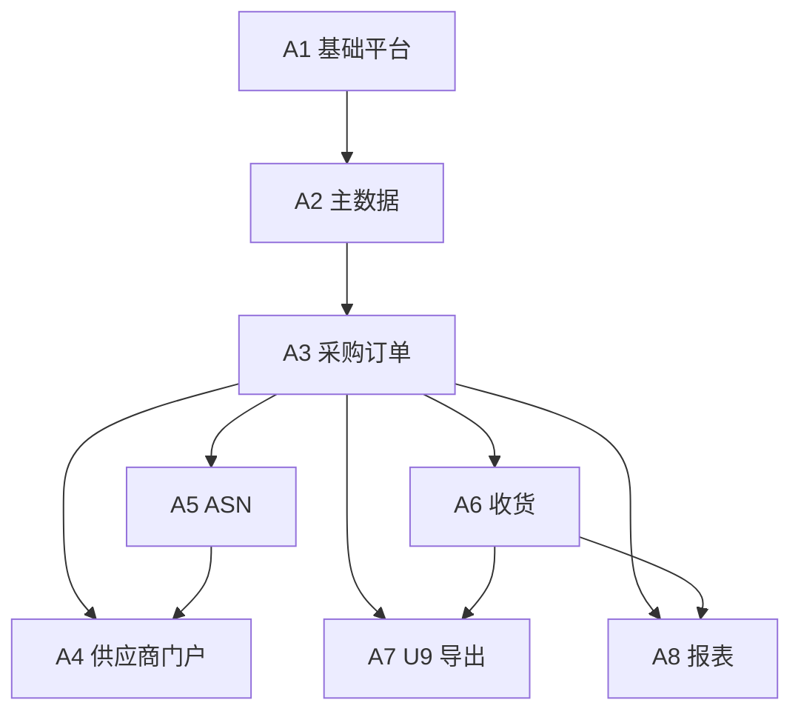

# SRM 开发计划

> 版本：v1.25  
> 依据：[SRM建设方案.md](./SRM建设方案.md)（**v1.7.0**）  
> 原则：**先业务闭环（阶段 A），再增强（阶段 B-1 / B-2），最后 AI（阶段 C）**。  
> **v1.25**（**不涉及 U9**）：门户 **RFQ 列表** 改为 `RfqRepository.findInvitedForSupplierWithStatuses`（受邀 + 状态过滤），替代 **findAll**；**PO/ASN GET** 与 **`todo-summary`** 增加 **`@Transactional(readOnly = true)`** 与 RFQ GET 一致，降低 LAZY 风险。  
> **v1.24**（**不涉及 U9**）：门户 **`supplierId` 前端 store 去掉默认 1**（`number | null` + RFQ 详情 `storeToRefs`）；`PortalRfqController` **GET** 加只读事务防 LAZY；`PortalTodoControllerWebTest` **401/403**。  
> **v1.23**（**不涉及 U9**）：门户 **供应商身份会话优先**：`PortalSupplierSession` 统一解析（**SESSION_SUPPLIER_ID** 优先于 query/header，防伪造）；PO/ASN/RFQ/**todo-summary** 接入；前端 **移除 supplierId 查询参数**；补充 **403**（已登录非供应商无联调参数）与合同/质量门户 **401** 用例。  
> **v1.22**（**不涉及 U9**）：门户 **合同 / 绩效考核（已发布）/ 质量协同（质检+纠正措施）** 只读 API 与页面；主导航入口；消息中心 **PERF_EVAL / CONTRACT / QUALITY_INSPECTION / CORRECTIVE_ACTION** 跳转；`PortalPerfControllerWebTest` 未登录 **401**。  
> **v1.21**（**不涉及 U9**）：生产级 **业务时区**：`srm.business-timezone` 默认 **Asia/Shanghai**，启动时设置 **JVM 默认时区**；`spring.jackson.time-zone` 与 **合同到期定时任务** `zone` 对齐；`docker-compose` MySQL 增加 `TZ`。  
> **v1.20**（**不涉及 U9**）：**B1-4**：**绩效发布** → 供应商 + 供应商授权组织内干系人；**合同** 激活/终止 + **每日 08:00** 到期提醒（到期前 30 天 / 7 天 / 当日，双向通知）；**质检登记 / 纠正措施创建与关闭** → 供应商 + 采购组织干系人；管理端消息中心补充 **考核/合同/质量** ref 跳转。  
> **v1.19**（**不涉及 U9**）：**B1-4 再深化**：管理端顶栏铃铛 **登录/焦点/页签可见/标已读后** 刷新未读；消息中心 **审批/发票/收货单** 快捷跳转；**内部用户站内信**：PR/PO **审批待办**（按规则角色）、**供应商提交发票**、**供应商确认订单行**、**登记收货单** → 对应采购组织干系人角色（ADMIN/BUYER/BUYER_MANAGER/WAREHOUSE）。  
> **v1.18**（**不涉及 U9**）：**B1-4 深化**：管理端工作台 `dashboard/stats` 返回 **未读站内消息数** 并 **首页提示 + 链至消息中心**；**发票确认/驳回** 向供应商写站内通知（`INVOICE_*`）；**RFQ 定标** 向中标供应商通知（`RFQ_AWARDED`）；门户待办带 **未读消息** 芯片、消息列表 **发票类 ref** 跳转发票页。  
> **v1.17**（**不涉及 U9**）：门户 **ASN 提交** 写供应商站内通知；**消息中心** 页（`/notifications`）+ 顶部铃铛未读角标；`PortalNotificationController` **按会话供应商** 校验已读、**全部已读**；管理端/门户 **T11-④** 列表空状态统一（`DataTableEmpty` + `emptyCopy`）；工作台待办空状态与快捷入口路径修正。  
> **v1.16**（**不涉及 U9**）：门户 **询价报价**（列表/详情/提交报价）、待办带 **待报价询价** 计数；`todo-summary` 第三字段 `pendingRfqQuotations`；**RFQ 发布** 向受邀供应商发站内通知（与 PO 发布通知一致走 `NotificationService`）。  
> **v1.15**：**B2-1 / B2-2** 管理端闭环：菜单 **寻源与合同**（询价列表/新建/详情含发布与定标；合同台账/即将到期/新建/详情含激活与终止）；**B2-3** 与既有 **采购分析报表**（金额趋势、份额、交期达成、价格波动）合并勾选。  
> **v1.14**：**B1-1** 生命周期与 **下单拦截**（待审核/黑名单/淘汰不可建 PO 或 PR 转单）；主数据供应商 **状态列 + 改状态 + 审计**；**B1-4** 管理端消息中心、通知 API **仅会话用户**、**PO 发布** 供应商站内信；**B1-5** 管理端 **质量协同**（质检 / 纠正措施）。  
> **v1.13**：**T12** 发票创建侧 **三单匹配最小硬规则**（订单行累计数量、单价容差、收货单行数量、物料编码）；`InvoiceRepository.sumInvoicedQtyByPurchaseOrderLineId`；冒烟表同步。  
> **v1.12**：落实 **T8**（[MVP冒烟检查表.md](./MVP冒烟检查表.md) + `mvn test` 门户用例）、**T10/T11** 与 **B1-2/B1-3/B1-6**（会话过滤器、`withCredentials`、组织记忆、门户待办带）；**§0.1/§0.2** 状态同步。  
> **v1.11**：与方案 **§2.2、§5.3** 对齐，新增 **§0.2 阶段 B WBS 任务清单（B1-1～B2-4）**；**§7** 展开为与阶段 A 同级 WBS；**§5** 参考进度延伸至 **Sprint 12**。  
> **v1.10**：对齐方案 **§2.3.1～2.3.2、附录 C/C.1**；补充 **Sprint 8～9（甄云深化）** 与 **§4.9 阶段 B WBS**；任务 **T10/T11** 拆验收要点。

---

## 0. 一期开发启动（当前迭代）

### 0.0 与甄云 SRM 的对应关系（执行层面）

| 说明 | 内容 |
|------|------|
| **对标方式** | 参考甄云类产品的 **域分层（§2.3.1）、协同主链、审批与门户体验（§2.3.2）**，见方案 **§2.3**、**附录 C/C.1** |
| **MVP 必验** | 仍以方案 **§2.1 + §3.2** 为准：主数据 → PO → 审批/发布 → 门户确认 → ASN → 收货 → 导出/报表 |
| **阶段 B** | 拆为 **B-1（近期）** 与 **B-2（中期）**，任务编号 **B1-1～B1-6、B2-1～B2-4** 见 **§0.2** 与方案 **§5.3**；PR/审批/绩效/发票等 **已部分落地**，贯通与体验以 **B-1** 为主；RFQ/合同/回写以 **B-2** 为主；**附录 C.1** 全量差距 **不默认排期** |
| **预期管理** | 向业务同步：**本期 ≠ 甄云全量功能**；以本计划勾选任务与方案阶段范围为准 |

**已落地工程骨架**（对应阶段 A / Sprint 0～1 方向）：

| 工程 | 路径 | 说明 |
|------|------|------|
| 后端 | `srm-backend/` | Spring Boot 3 + JPA + Flyway + 账套/组织/仓库 API + dev 种子数据 |
| 管理端 | `srm-admin-web/` | Vue3 + TS + Vite（**5173**）+ Element Plus：主数据、PO、**收货/导出/报表**、**寻源与合同（RFQ/合同台账）**、协同与质量等；阶段 B 菜单扩展见下 |
| 门户 | `srm-portal-web/` | Vue3 + TS + Vite（**5174**）+ Element Plus：已发布 PO、行确认、**ASN**、**询价报价**、**发票**、**合同/绩效/质量只读**、消息中心（v1.22） |

**本机联调步骤简述**：`docker compose up -d`（在 `srm-backend`）→ `mvn spring-boot:run` → 两个前端分别 `npm run dev`，浏览器访问上述端口。

**已完成（代码落地）— 阶段 A（A1～A8）**：A2 主数据 API + 管理端页面；A3 PO API + 管理端列表/新建/详情与状态按钮；A4 门户已发布 PO 列表、行确认；**A5 ASN**（Flyway、服务、管理端按 PO 查看、门户列表/新建）；**A6 收货**（GR、累计 `received_qty`、可选 ASN 行、超收比例配置）；**A7 U9 导出**（PO/GR 单 Sheet xlsx、`export_status`）；**A8 报表**（采购执行在途 API + 管理端报表页）。

**阶段 B（已部分落地，待联调/深化）**：**请购 PR**（列表/新建/详情、提交审批、按行转 PO）；**审批引擎**（规则配置、审批实例、工作台审批动作）；**供应商绩效**（模板/维度/评分/发布）；**对账与发票**（管理端列表/详情/确认；门户提交发票）。*与甄云同类模块为「最小可运营版」，细节（待办中心、三单匹配校验强度、绩效方案库）按后续迭代补齐。*

### 0.1 阶段 A 收尾任务清单（可勾选）

> 状态列：`□` 未开始 / 进行中，`☑` 已完成（手工维护即可）。  
> **目标 Sprint** 对齐 §5「参考进度」：`6～7` 表示可自 Sprint 6 启动、在 Sprint 7 前关闭。

| 序号 | 任务 | 目标 Sprint | 说明 / 验收要点 | 状态 |
|------|------|-------------|-----------------|------|
| T1 | **四工厂（四采购组织）配置与回归** | Sprint 7 | 每组织一条端到端 PO→ASN→GR；**禁止跨组织混单**用例通过；管理端/门户仅见授权范围数据 | ☑ |
| T2 | **U9 测试账套导入联调** | Sprint 7 | 使用 **R1 冻结模板**（或当前导出列约定）导入 PO/GR 样本；抽检外部单号/号段策略与业务确认一致 | □（暂缓） |
| T3 | **A7 导出能力硬化** | Sprint 6～7 | 从同步导出演进为 **异步任务 + 失败可重试 + 错误明细**；`export_status` 含 **FAILED** 路径可运营处理（与 §4.7 对齐） | □（暂缓） |
| T4 | **门户水平越权防护** | Sprint 7 | 篡改订单号/ASN id/供应商上下文等 **必须 403/404**；沉淀 **API 自动化用例**（可与 CI 挂钩） | ☑ |
| T5 | **主数据 Excel 导入** | Sprint 6～7 | 供应商/物料（及错误行报告）；与 §4.2「可选但建议」一致 | ☑ |
| T6 | **PO Excel 导入** | Sprint 6～7 | 模板、校验、错误报告；**不含 PR 转单**（§4.3） | ☑ |
| T7 | **A1 权限与审计补强** | Sprint 6～7 | 由「全放行联调」过渡到 **按角色 + 采购组织数据范围**；关键单据/主数据 **审计日志**可查（§4.1） | ☑ |
| T8 | **MVP 冒烟与验收脚本** | Sprint 7 | 覆盖方案 §3.2 **Happy Path** + 超收/关单/导出失败等异常；输出可重复执行的检查表或自动化套件；**附录 C 阶段 B 项单独作为回归扩展**（可选） | ☑（[MVP冒烟检查表.md](./MVP冒烟检查表.md)；`mvn test` 含门户 401/越权用例） |
| T9 | **非功能最低线** | Sprint 7 | HTTPS、密码策略、附件大小限制；核心接口 **限流**（可选）与 §6 对齐 | ☑ |
| T10 | **阶段 B 与 PO/PR/审批链贯通** | Sprint 8～9 | **验收**：① PR 提交/审批通过后状态正确；② 创建审批实例（`docType=PR`，金额=行合计参考价或配置口径）；③ PO 创建/发布可触发 `docType=PO` 审批（与现有 `approve` 按钮并存或替换策略经产品确认）；④ 审批通过后 PR 转 PO 不因会话缺失失败。**对标**：附录 C「请购 + 审批中心」 | ☑（PO/PR 走提交审批+中心；前后端 **`withCredentials`** 携带会话） |
| T11 | **甄云级体验补全（择优）** | Sprint 8+ | **验收（可选多项）**：① 工作台展示「待我审批」数量或跳转审批列表；② 门户首页突出待确认 PO / 待办 ASN；③ 列表记住组织筛选；④ 统一空状态文案与引导链接。**不阻塞 MVP** | ☑①②③④（④：`emptyCopy` + `DataTableEmpty` 覆盖主要列表；门户 PO/ASN/发票/询价 + 消息中心；v1.17） |
| T12 | **结算域深化（三单匹配 / 对账自动化）** | Sprint 9+ | **验收**：发票行与 PO/GR 数量金额校验规则可配置或最小硬规则；对账单可由期间内 PO/GR/发票汇总生成（或半自动）；**对标**：附录 C「对账/发票」高于当前「登记 + 确认」；与 **§0.2 B1-4/B2-4** 可并行排期 | ☑（**最小硬规则** 已落地，见 `InvoiceService.validateInvoiceLineAgainstDocs`；对账汇总原已自动；**可配置规则** 仍可选） |

### 0.2 阶段 B WBS 任务清单（B-1 / B-2，可勾选）

> 与方案 **§2.2、§5.3** 一一对应；状态列：`□` 未开始 / 进行中，`☑` 已完成。  
> **映射**：**T10** 主要覆盖 **B1-2**；**T11** 覆盖 **B1-3** 部分体验；**T12** 与 **B2-4**、对账深化交叉；供应商生命周期 **B1-1**、消息 **B1-4**、质量 **B1-5**、门户会话 **B1-6** 可独立拉分支迭代。

**B-1（近期，约 4～6 周）**

| 编号 | 任务 | 目标 Sprint | 说明 / 验收要点 | 状态 |
|------|------|-------------|-----------------|------|
| B1-1 | **供应商全生命周期** | Sprint 8～10 | 准入审核、合格/临时/暂停/淘汰等状态机；门户自助注册；状态与 **组织授权**、可下单范围联动；审计可追溯（方案 §3.5） | ☑（**下单拦截** + 主数据 **lifecycleStatus** 与改状态/审计 UI；暂停态若业务需单独枚举可后续细化） |
| B1-2 | **审批引擎接入 PR/PO** | Sprint 8～9 | PR/PO 提交或关键动作 **创建审批实例**；通过/驳回 **回写单据状态**；与 **T10** 同验收口径（方案 B1-2） | ☑ |
| B1-3 | **工作台 / 看板** | Sprint 9～10 | 卡片：待审批数、本月订单金额、待收货行、待处理发票等；待办列表 + 快捷入口；后端 **dashboard 聚合接口**（方案 B1-3） | ☑ |
| B1-4 | **消息与通知中心** | Sprint 10～11 | 站内消息、待办聚合；供应商新 PO/ASN 等提醒（邮件/企微可选）（方案 B1-4） | ☑（双向：**供应商** 侧 PO/RFQ/ASN/发票结果等；**内部用户** 侧审批待办、发票提交、订单行确认、收货登记等；顶栏铃铛刷新策略 v1.19；邮件/企微仍可选） |
| B1-5 | **质量协同基础** | Sprint 10～11 | 质检记录、不合格处理、供应商整改单；与门户通知可选联动（方案 §3.6、B1-5） | ☑（管理端质检登记 + 纠正措施；**质检/整改单 站内信** 双向知会；v1.20） |
| B1-6 | **Portal Session 与安全加固** | Sprint 8～9 | 供应商会话属性名与登录写入 **统一常量**；`SecurityConfig` 收紧至生产口径；水平越权与 **T4** 回归（方案 B1-6） | ☑（`SessionAuthFilter` + 通知 API 常量；**全站 API 需登录会话** 除登录/公开注册/Swagger；**门户 PO/ASN/RFQ 供应商 ID 以会话为准** v1.23） |

**B-2（中期，约 6～8 周）**

| 编号 | 任务 | 目标 Sprint | 说明 / 验收要点 | 状态 |
|------|------|-------------|-----------------|------|
| B2-1 | **寻源（RFQ）** | Sprint 11～12+ | 发布 → 报价 → 评标 → 定标；最小闭环可演示（方案 B2-1） | ☑（管理端见 v1.15；门户 **列表/详情/提交报价**、待办 **待报价询价**、发布 **站内通知**；v1.16） |
| B2-2 | **合同台账** | Sprint 11～12+ | 合同头行、状态、关联供应商/物料、价格约束、到期预警（方案 B2-2） | ☑（管理端 **列表/即将到期(30天)/新建/详情**、**激活/终止**；价格约束与 PO 联动深化仍可选） |
| B2-3 | **报表增强** | Sprint 11～12+ | 金额趋势、份额、交期达成、价格波动等主题（方案 B2-3） | ☑（**采购分析报表** 已含四类主题 API + 图表；更多维度/导出仍可选） |
| B2-4 | **U9 导入结果回写** | 视 R2 | 回传解析、导出批次/单据状态更新、失败字典；与 **T2/T3**、方案 R2 联动（方案 B2-4） | □ |

---

## 1. 目标与范围

| 项 | 说明 |
|----|------|
| 本计划首期范围 | **阶段 A：MVP 业务闭环**（A1～A8）；**不含** 阶段 C（AI） |
| MVP 与阶段 B | **MVP 验收**以 PO 主链为主（方案 §2.1）；PR/审批/绩效/对账发票等 **代码已部分落地**，完整贯通按 **§0.2 B-1** 与 **T10～T12** 排期；**B-2** 按 **§0.2** 与资源在 MVP 稳定后启动；**附录 C.1 差距项** 不自动进入迭代 |
| 验收指向 | 单工厂端到端 → **四工厂并行配置** → **U9 测试账套导入抽检**（T2） |
| 阶段 C | 公有云 AI —— 仅保留窗口与依赖说明（方案 §5.4） |

---

## 2. 前提假设（可随项目调整）

| 假设 | 建议值 | 说明 |
|------|--------|------|
| 迭代周期 | **2 周 / Sprint** | 便于演示与回归 |
| 后端 + 前端 | **≥2 人专职开发** 起算 | 低于此则周期按比例拉长 |
| 测试 | 每 Sprint 含 **冒烟 + 核心路径**；MVP 前 **2 周专项回归** | 可兼职或由开发交叉 |
| 环境与账号 | Sprint 1 内具备 **开发 / 测试** 环境及 **U9 测试账套**（或模拟验收用例） | 导入模板以 R1 冻结为准 |
| 产品/业务 | 每 Sprint 有 **固定对接人** 做规则拍板（审批矩阵、超收比例、变更策略等） | |

### 2.1 技术选型（已定）

与方案 §4.1 一致，开发落地默认：

| 层次 | 选型 |
|------|------|
| 后端 | Java **Spring Boot 3**，JDK **17 或 21**，REST + **OpenAPI** |
| 前端 | **Vue 3** + **TypeScript** + **Vite**（管理端、门户同栈，部署可分应用） |
| 数据库 | **MySQL 8**，**utf8mb4** |
| 建议配套 | **Redis**；附件 **对象存储**（MinIO / 云 OSS） |

### 2.2 代码仓库（分仓，已定）

| 仓库 | 建议目录/仓库名 | 职责 |
|------|-----------------|------|
| 后端 | `srm-backend` | Spring Boot、API、领域服务、导出任务、与 MySQL/Redis/OSS 交互 |
| 管理端 | `srm-admin-web` | Vue3+TS+Vite，采购/仓管/系统管理 |
| 供应商门户 | `srm-portal-web` | Vue3+TS+Vite，供应商登录、PO 确认、ASN |

三本仓 **独立版本与 CI/CD**；共享约定通过 **OpenAPI 契约** 与（可选）私有 npm 包或复制粘贴最小类型定义，**不强制 monorepo**。

本地可把三仓与本文档放在同一父目录（如本仓库 `d:\SRM` 下的子文件夹）便于联调，生产仍按三仓分别发布。

---

## 3. 模块依赖关系（阶段 A）

说明：**门户 A4** 依赖 **A3（PO）** 与 **A5（ASN 接口与数据）**；**A7** 需 PO、收货数据与 **附录 A 冻结映射**。

### 3.1 阶段 B 扩展（甄云域对齐，非 MVP 关键路径）

阶段 **B-1 / B-2** 能力（见 **§0.2、§7**）在实现上 **依赖 A1 组织与权限、A2 主数据、A3 PO**；**B2-4 回写** 依赖 **A7 导出状态** 与方案 **R2**。路线图与甄云域的对应关系见方案 **附录 C、§2.2**，开发上不阻塞 A1→A8 主线。

---

## 4. 阶段 A 工作分解（WBS）

### 4.1 A1 基础平台

| 工作项 | 交付物 |
|--------|--------|
| 工程脚手架、配置、多环境 | 可部署的 dev/test 构建流水线（形式不限） |
| 用户、角色、权限（RBAC） | 角色模板：采购员、采购主管、仓管、集团管理员、供应商用户 |
| 账套、组织、采购组织、仓库 | CRUD + **数据权限范围**（按采购组织隔离） |
| 审计日志 | 关键单据与主数据变更可追溯 |
| 编码规则配置 | **PO 号、GR 号**生成（账套+组织内唯一，与 U9 历史号段策略对齐） |

### 4.2 A2 主数据

| 工作项 | 交付物 |
|--------|--------|
| 供应商、物料、仓库档案 | 与组织/账套关系正确；供应商 **门户授权组织** |
| U9 映射字段 | 账套编码、组织编码等与 U9 一致性校验（格式/必填） |
| Excel 导入（可选但建议） | 主数据批量初始化，错误行报告 |
| 与 PO 联动校验 | PO 保存时校验供应商/物料/仓库 **属于本单组织** |

### 4.3 A3 采购订单

| 工作项 | 交付物 |
|--------|--------|
| PO 头行 CRUD | **禁止跨工厂/跨账套组织混行** |
| 状态机 | 草稿 → 审批中 → 已发布 → … → 关闭（细则由产品定） |
| 审批流 | **四工厂共用同一套矩阵**（可配置阈值/品类）；待办与审批历史 |
| 修订版 | 变更产生修订号；协同与收货挂 **当前有效版本**（与方案 §3.3 一致） |
| PO Excel 导入 | 模板、校验、错误报告；**不含 PR 转单** |
| 附件 | 上传、权限、与 PO 绑定 |
| 发布到门户 | 发布后供应商可见；权限过滤 |

**产品待拍板（建议 Sprint 内关闭）**：PO 变更后是否 **要求供应商重新确认**。

### 4.4 A5 ASN（与门户并行推进）

| 工作项 | 交付物 |
|--------|--------|
| ASN 头行、与 PO 行关联 | 数量、批次、运单等（字段按业务最小集） |
| 校验 | 与 PO 单位/料号/可发数量；**不超发规则**可配置 |
| 状态与列表 | 采购端查询、与 PO 执行联动展示 |

### 4.5 A4 供应商门户

| 工作项 | 交付物 |
|--------|--------|
| 登录与密码策略 | HTTPS；**不强认证**（与方案一致） |
| PO 列表与详情 | 仅 **授权供应商 + 授权组织** |
| 订单确认 | 确认数量、承诺交期、备注；写回 PO 协同信息 |
| ASN | **提交、列表、详情**（与 A5 对接） |
| 安全测试 | 水平越权（篡改单号/供应商）**必须拦截** |

### 4.6 A6 收货

| 工作项 | 交付物 |
|--------|--------|
| 收货单头行 | 选 PO 行、仓库；**可选勾 ASN** |
| 分批收货、累计数量 | **超收比例**可配置；关行/关单规则 |
| 与 PO/ASN 状态 | 可收余额、执行报表数据源 |

### 4.7 A7 U9 导出

| 工作项 | 交付物 |
|--------|--------|
| PO 导出 | **单文件单 Sheet**，列与《导入映射说明书》（R1 冻结）一致 |
| 收货导出 | **独立文件单 Sheet** |
| 导出任务与日志 | 异步任务、失败重试、错误明细 |
| **导出状态（MVP 必做）** | 未导出 / 已导出 / 导出失败等，支持运营 **不重复误导** |
| 表结构预留 | 导入结果回写字段（阶段 B 启用） |

### 4.8 A8 报表（最小集）

| 工作项 | 交付物 |
|--------|--------|
| 执行类报表 | 按工厂/仓库/供应商：PO 执行、收货汇总、待确认/待收货等 |
| 导出权限 | 与组织数据权限一致 |

### 4.9 阶段 B 工作分解（与方案 §5.3、§0.2 编号对齐）

> **不替代** A1～A8 验收。详细勾选与目标 Sprint 以 **§0.2** 为准；本节按 **B-1 / B-2** 归纳交付物。

**B-1 工作包**

| 编号 | 工作项 | 交付物 | 对标域（沟通用语） |
|------|--------|--------|-------------------|
| B1-1 | 供应商全生命周期 | 准入、状态机、门户注册、与授权/下单联动 | 供应商管理 |
| B1-2 | 审批引擎贯通 | PR/PO 创建审批实例、通过/驳回回写；与现有 PR/PO 页面联调 | 审批中心 |
| B1-3 | 工作台 / 看板 | Dashboard API + 管理端首页卡片与待办区 | 工作台 |
| B1-4 | 消息与通知 | 站内信、待办聚合、供应商提醒通道（可选邮件/企微） | 系统 / 协同 |
| B1-5 | 质量协同基础 | 质检、不合格、整改单 | 质量协同 |
| B1-6 | Portal 与安全 | 会话常量统一、`SecurityConfig` 收紧、越权回归 | 系统管理 |
| — | PR 与转 PO（已部分落地） | 请购全状态、按供应商分组转 PO、与执行报表联动 | 敏捷协同 · 请购 |
| — | 绩效（已部分落地） | 模板、维度、评分、发布；与 B1-1 整改联动深化 | 供应商管理 · 绩效 |
| — | 对账与发票（已部分落地） | 发票确认/退回、对账单；自动汇总与强匹配见 **T12 / B2-4** | 结算协同 |

**B-2 工作包**

| 编号 | 工作项 | 交付物 | 对标域（沟通用语） |
|------|--------|--------|-------------------|
| B2-1 | RFQ | 询报价发布、报价、评标、定标 | 智慧寻源 |
| B2-2 | 合同台账 | 头行、状态、关联、到期预警 | 寻源 / 合同 |
| B2-3 | 报表增强 | 趋势、份额、交期、价格波动 | 分析 / 数据中台 |
| B2-4 | U9 回写 | 回传解析、状态闭环、失败字典 | 集成层 |

---

## 5. 参考进度（约 12～16 周，2 周 Sprint）

> 以下为 **参考排期**：人力增加可压缩关键路径（主要是 A3/A4/A6）；人力减少则整体后移。

| Sprint | 周期（建议） | 目标交付 |
|--------|----------------|----------|
| **Sprint 0** | 第 1～2 周 | 仓库/规范/环境、A1 **组织与权限骨架**、首个可登录空壳 |
| **Sprint 1** | 第 3～4 周 | A1 **完成**；A2 **供应商/物料/仓库主数据** 主流程 |
| **Sprint 2** | 第 5～6 周 | A2 **完成** + 主数据导入；A3 PO **头行 + 状态机 + 发号** |
| **Sprint 3** | 第 7～8 周 | A3 **审批流 + 发布门户 + PO Excel 导入 + 修订版** |
| **Sprint 4** | 第 9～10 周 | A5 **完成**；A4 门户 **PO 确认 + ASN** |
| **Sprint 5** | 第 11～12 周 | A6 **收货全流程**；联调 PO→ASN→GR |
| **Sprint 6** | 第 13～14 周 | A7 **双模板导出 + 导出状态**；A8 **最小报表** |
| **Sprint 7** | 第 15～16 周 | **四工厂数据配置**、性能与权限回归、**U9 导入联调**、UAT 缺陷收敛 |
| **Sprint 8** | 第 17～18 周（建议） | **T8** MVP 冒烟与验收脚本定稿；**T10 / B1-2** 启动：PR/PO 与审批实例贯通；**B1-6** Portal 会话与安全加固启动 |
| **Sprint 9** | 第 19～20 周（建议） | **T10 / B1-2** 收尾；**T11 / B1-3** 工作台体验择优；**T12** 或 **B1-1** 启动（与业务确认优先级） |
| **Sprint 10** | 第 21～22 周（建议） | **B1-1** 供应商生命周期迭代；**B1-3** 看板指标与接口；**B1-4** 消息中心启动 |
| **Sprint 11** | 第 23～24 周（建议） | **B1-4** 收尾；**B1-5** 质量协同基础；**B2-1 / B2-2** 可启动（寻源或合同台账择一优先） |
| **Sprint 12** | 第 25～26 周（建议） | **B2-1 / B2-2** 并行或交替；**B2-3** 报表增强；**B2-4** 视 R2 与 U9 环境插入或顺延 |

**关键路径**：A1 → A2 → A3 →（A5 ∥ A4）→ A6 → A7 → 联调/UAT → **B-1**（B1-2 → B1-3/B1-4/B1-5，B1-1/B1-6 与 T10 并行）→ **B-2**（B2-1～B2-4 按价值排序）。

---

## 6. 测试与验收（MVP）

| 类型 | 内容 |
|------|------|
| 功能验收 | 方案 §3.2 七步闭环 **Happy Path** + 异常：越权、超收、关单、导出失败重试 |
| 多组织 | **四采购组织** 各跑通一条 PO；**禁止跨工厂 PO** 用例必过 |
| U9 | 使用 **冻结模板** 导出 → 测试账套导入 → 抽检 **单号不重复策略** |
| 非功能 | HTTPS、密码策略、附件限制；核心接口限流（可选） |

**MVP 通过标准（建议）**：业务签字 **单厂 + 四厂** 场景；IT 签字 **导入成功样本 + 导出状态可追溯**。

---

## 7. 阶段 B / C（WBS 与窗口说明）

### 7.1 触发条件与阶段边界

| 阶段 | 触发条件 | 说明 |
|------|----------|------|
| **B-1** | MVP 核心稳定，或与 U9 导入并行 | 以 **§0.2 B1-1～B1-6** 为 backlog；优先 **B1-2（审批贯通）**、**B1-6（安全）**，其余按业务价值并行 |
| **B-2** | B-1 关键项达标或资源独立 | 以 **§0.2 B2-1～B2-4** 为 backlog；**B2-4** 强依赖方案 **R2** 与 U9 实施方 |
| **C** | 业务数据质量稳定、通过安全评审 | 方案 **§5.4**、附录 B：公有云 API、脱敏、C1～C4 按价值排序 |

### 7.2 阶段 B-1 详细 WBS（与 §4.9、§0.2 一致）

| 编号 | 工作包 | 主要产出 | 依赖 / 备注 |
|------|--------|----------|-------------|
| B1-1 | 供应商全生命周期 | Flyway/领域模型/状态机、门户注册、采购端审核、与主数据联动 | 依赖 A2；可与 B1-5 分期 |
| B1-2 | 审批引擎接入 | `PurchaseRequisitionService` / `PurchaseOrderService` 与 `ApprovalService` 贯通；回调更新状态 | 依赖 A1 审批规则与实例；**T10** |
| B1-3 | 工作台看板 | `DashboardController` 或等价聚合 API；`HomeView` 类页面重构 | 依赖 A3/A6/发票只读统计 |
| B1-4 | 消息通知中心 | 消息表、站内列表、待办聚合；可选邮件/企微 | 可与 B1-3 分迭代 |
| B1-5 | 质量协同基础 | 质检单、不合格、整改单 API + 管理端/门户入口 | 依赖 A3/A6 |
| B1-6 | Portal Session 与安全 | 会话常量统一、`SecurityConfig` 路径与角色、回归测试 | 与 **T4/T7** 衔接 |

### 7.3 阶段 B-2 详细 WBS

| 编号 | 工作包 | 主要产出 | 依赖 / 备注 |
|------|--------|----------|-------------|
| B2-1 | RFQ | RFQ 头行、供应商报价、评标与定标、管理端+门户报价入口 | 依赖 A2 供应商/物料 |
| B2-2 | 合同台账 | 合同主数据、关联 PO/物料、到期预警、列表与详情 | 可选与 B2-1 定标衔接 |
| B2-3 | 报表增强 | 新报表 API + 前端图表（趋势、份额、交期、价格） | 依赖 A3/A6/执行数据质量 |
| B2-4 | U9 回写 | 回传文件或中间表解析、更新 `export_status` 与对账字段 | **R2**、A7；与 **T2/T3** 协调 |

### 7.4 阶段 C（摘要）

与方案 **§5.4** 一致：AI 不替代审批；公有云调用须 **脱敏、审计、可关闭**。不在本阶段默认排入 Sprint，单独立项后插入 **§5** 参考表。

---

## 8. 风险与依赖（跟踪用）

| 风险/依赖 | 缓解 |
|-----------|------|
| **R1 模板未冻结** | A7 开发先用「内部约定列」+ 映射配置表，模板一到只做配置切换 |
| **主数据职责不清（R4）** | Sprint 2 前业务书面确认 SRM/U9 建档顺序 |
| **GR 号策略（R3）** | Sprint 3 前与 U9 实施方确认是否外部单号 |
| U9 测试环境不可用 | 先做 **文件 golden sample** 验收，环境就绪后补联调 |
| 门户弱口令 | 上线前 **密码复杂度 + 定期改密策略** 最低限度加固 |

---

## 9. 修订记录

| 日期 | 版本 | 说明 |
|------|------|------|
| 2026-04-04 | v1.0 | 首版：阶段 A WBS、依赖、7×2 周参考节奏、验收与风险 |
| 2026-04-04 | v1.1 | 技术选型：Vue3+TS、Spring Boot 3、MySQL 8；依据方案 v1.4.0 |
| 2026-04-04 | v1.2 | 代码 **分仓**（srm-backend / srm-admin-web / srm-portal-web）；依据方案 v1.4.1 |
| 2026-04-05 | v1.3 | 一期工程骨架：后端 A1 API + 双前端联调页；§0 启动说明 |
| 2026-04-05 | v1.4 | A5～A8 闭环：ASN/收货/导出/报表 API + 管理端与门户页面；§0 状态更新 |
| 2026-04-05 | v1.5 | §0.1 阶段 A 收尾任务清单（表格，可勾选状态列） |
| 2026-04-05 | v1.6 | §0.1 增加「目标 Sprint」列，与 §5 参考排期对齐 |
| 2026-04-05 | v1.7 | T4 部分落地：门户 GET 详情/ASN 非本供应商 **404**；行确认、创建 ASN 非本单供应商 **403**；`ForbiddenException` + `Portal*WebTest`；按组织授权过滤列表仍归 **T1** |
| 2026-04-06 | v1.17 | ASN 提交供应商通知；门户消息中心 + 通知 API 加固；T11-④ 空状态统一 |
| 2026-04-06 | v1.16 | 门户 RFQ 报价闭环 + `pendingRfqQuotations` 待办；RFQ 发布供应商通知（非 U9） |
| 2026-04-06 | v1.15 | **B2-1～B2-3**：管理端 RFQ/合同台账页面与菜单；**B2-3** 与采购分析报表合并验收 |
| 2026-04-06 | v1.14 | **B1-1 / B1-4 / B1-5**：生命周期与 PO/PR 下单拦截；主数据状态与审计；通知中心（会话 API + PO 发布供应商通知）；质量协同管理端页面 |
| 2026-04-06 | v1.13 | **T12** 发票行与 PO/GR **最小校验**（累计开票≤已收、单价容差、收货单行、物料编码）；修订 **MVP冒烟检查表** |
| 2026-04-06 | v1.12 | **T8** [MVP冒烟检查表.md](./MVP冒烟检查表.md)；**SessionAuthFilter** + 双前端 `withCredentials`；**T10/T11**、**B1-2/B1-3/B1-6** 在 §0.1/§0.2 勾选；采购组织 **sessionStorage** 记忆；门户 **todo-summary** 与通知 API 会话常量 |
| 2026-04-06 | v1.11 | 依据方案 v1.7.0：新增 **§0.2**（B1-1～B2-4 可勾选清单）；**§7** 展开为 7.1～7.4 WBS；§5 延伸至 **Sprint 12**；§4.9 与方案 §5.3 编号对齐 |
| 2026-04-06 | v1.10 | 对齐方案 v1.6.0：§0 预期管理；§4.9 阶段 B WBS；§5 增加 Sprint 8～9；T10 验收细化；新增 **T12**；T11 验收条目化 |
| 2026-04-06 | v1.9 | 对齐方案 v1.5.0：§0 甄云映射与阶段 B 落地说明；§1 范围澄清；新增 T10/T11；T8 扩展附录 C；§7 阶段 B 表述更新 |
| 2026-04-06 | v1.8 | 阶段 A 收尾批量落地：T5 主数据 Excel 导入；T6 PO Excel 导入；T7 RBAC 用户角色 + 审计日志 + 会话认证；T1 多组织仓库查询修正；T9 密码策略 + 上传限制。T2/T3（U9 相关）暂缓 |
