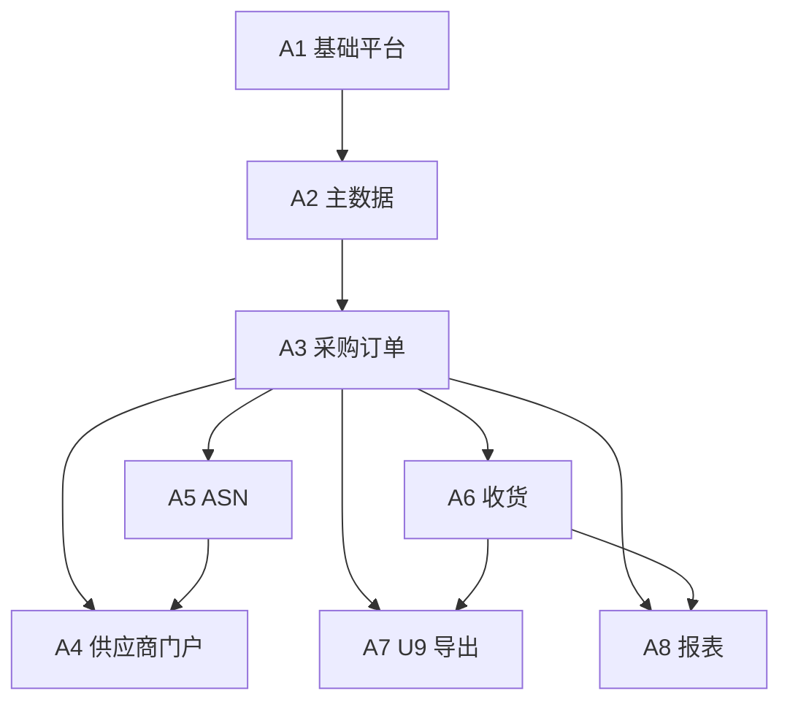

# SRM 开发计划

> 版本：v1.6  
> 依据：[SRM建设方案.md](./SRM建设方案.md)（v1.4.1）  
> 原则：**先业务闭环（阶段 A），再增强（阶段 B），最后 AI（阶段 C）**。

---

## 0. 一期开发启动（当前迭代）

**已落地工程骨架**（对应阶段 A / Sprint 0～1 方向）：

| 工程 | 路径 | 说明 |
|------|------|------|
| 后端 | `srm-backend/` | Spring Boot 3 + JPA + Flyway + 账套/组织/仓库 API + dev 种子数据 |
| 管理端 | `srm-admin-web/` | Vue3 + TS + Vite（**5173**）+ Element Plus：主数据、PO、**收货/导出/执行报表** |
| 门户 | `srm-portal-web/` | Vue3 + TS + Vite（**5174**）+ Element Plus：已发布 PO、行确认、**ASN 列表/新建** |

**本机联调步骤简述**：`docker compose up -d`（在 `srm-backend`）→ `mvn spring-boot:run` → 两个前端分别 `npm run dev`，浏览器访问上述端口。

**已完成（代码落地）**：A2 主数据 API + 管理端页面；A3 PO API + 管理端列表/新建/详情与状态按钮；A4 门户已发布 PO 列表、行确认（`supplierId` / `X-Dev-Supplier-Id` 联调）；**A5 ASN**（Flyway、服务、管理端按 PO 查看、门户列表/新建）；**A6 收货**（GR、累计 `received_qty`、可选 ASN 行、超收比例配置）；**A7 U9 导出**（PO/GR 单 Sheet xlsx、`export_status`）；**A8 报表**（采购执行在途 API + 管理端报表页）。

### 0.1 阶段 A 收尾任务清单（可勾选）

> 状态列：`□` 未开始 / 进行中，`☑` 已完成（手工维护即可）。  
> **目标 Sprint** 对齐 §5「参考进度」：`6～7` 表示可自 Sprint 6 启动、在 Sprint 7 前关闭。

| 序号 | 任务 | 目标 Sprint | 说明 / 验收要点 | 状态 |
|------|------|-------------|-----------------|------|
| T1 | **四工厂（四采购组织）配置与回归** | Sprint 7 | 每组织一条端到端 PO→ASN→GR；**禁止跨组织混单**用例通过；管理端/门户仅见授权范围数据 | □ |
| T2 | **U9 测试账套导入联调** | Sprint 7 | 使用 **R1 冻结模板**（或当前导出列约定）导入 PO/GR 样本；抽检外部单号/号段策略与业务确认一致 | □ |
| T3 | **A7 导出能力硬化** | Sprint 6～7 | 从同步导出演进为 **异步任务 + 失败可重试 + 错误明细**；`export_status` 含 **FAILED** 路径可运营处理（与 §4.7 对齐） | □ |
| T4 | **门户水平越权防护** | Sprint 7 | 篡改订单号/ASN id/供应商上下文等 **必须 403/404**；沉淀 **API 自动化用例**（可与 CI 挂钩） | □ |
| T5 | **主数据 Excel 导入** | Sprint 6～7 | 供应商/物料（及错误行报告）；与 §4.2「可选但建议」一致 | □ |
| T6 | **PO Excel 导入** | Sprint 6～7 | 模板、校验、错误报告；**不含 PR 转单**（§4.3） | □ |
| T7 | **A1 权限与审计补强** | Sprint 6～7 | 由「全放行联调」过渡到 **按角色 + 采购组织数据范围**；关键单据/主数据 **审计日志**可查（§4.1） | □ |
| T8 | **MVP 冒烟与验收脚本** | Sprint 7 | 覆盖方案 §3.2 **Happy Path** + 超收/关单/导出失败等异常；输出可重复执行的检查表或自动化套件 | □ |
| T9 | **非功能最低线** | Sprint 7 | HTTPS、密码策略、附件大小限制；核心接口 **限流**（可选）与 §6 对齐 | □ |

---

## 1. 目标与范围

| 项 | 说明 |
|----|------|
| 本计划首期范围 | **阶段 A：MVP 业务闭环**（A1～A8），不含请购、不含 AI |
| 验收指向 | 单工厂端到端 → **四工厂并行配置** → **U9 测试账套导入抽检** |
| 不在本期排期 | 阶段 B（回写、PR、寻源等）、阶段 C（公有云 AI）——仅保留窗口与依赖说明 |

---

## 2. 前提假设（可随项目调整）

| 假设 | 建议值 | 说明 |
|------|--------|------|
| 迭代周期 | **2 周 / Sprint** | 便于演示与回归 |
| 后端 + 前端 | **≥2 人专职开发** 起算 | 低于此则周期按比例拉长 |
| 测试 | 每 Sprint 含 **冒烟 + 核心路径**；MVP 前 **2 周专项回归** | 可兼职或由开发交叉 |
| 环境与账号 | Sprint 1 内具备 **开发 / 测试** 环境及 **U9 测试账套**（或模拟验收用例） | 导入模板以 R1 冻结为准 |
| 产品/业务 | 每 Sprint 有 **固定对接人** 做规则拍板（审批矩阵、超收比例、变更策略等） | |

### 2.1 技术选型（已定）

与方案 §4.1 一致，开发落地默认：

| 层次 | 选型 |
|------|------|
| 后端 | Java **Spring Boot 3**，JDK **17 或 21**，REST + **OpenAPI** |
| 前端 | **Vue 3** + **TypeScript** + **Vite**（管理端、门户同栈，部署可分应用） |
| 数据库 | **MySQL 8**，**utf8mb4** |
| 建议配套 | **Redis**；附件 **对象存储**（MinIO / 云 OSS） |

### 2.2 代码仓库（分仓，已定）

| 仓库 | 建议目录/仓库名 | 职责 |
|------|-----------------|------|
| 后端 | `srm-backend` | Spring Boot、API、领域服务、导出任务、与 MySQL/Redis/OSS 交互 |
| 管理端 | `srm-admin-web` | Vue3+TS+Vite，采购/仓管/系统管理 |
| 供应商门户 | `srm-portal-web` | Vue3+TS+Vite，供应商登录、PO 确认、ASN |

三本仓 **独立版本与 CI/CD**；共享约定通过 **OpenAPI 契约** 与（可选）私有 npm 包或复制粘贴最小类型定义，**不强制 monorepo**。

本地可把三仓与本文档放在同一父目录（如本仓库 `d:\SRM` 下的子文件夹）便于联调，生产仍按三仓分别发布。

---

## 3. 模块依赖关系（阶段 A）

说明：**门户 A4** 依赖 **A3（PO）** 与 **A5（ASN 接口与数据）**；**A7** 需 PO、收货数据与 **附录 A 冻结映射**。

---

## 4. 阶段 A 工作分解（WBS）

### 4.1 A1 基础平台

| 工作项 | 交付物 |
|--------|--------|
| 工程脚手架、配置、多环境 | 可部署的 dev/test 构建流水线（形式不限） |
| 用户、角色、权限（RBAC） | 角色模板：采购员、采购主管、仓管、集团管理员、供应商用户 |
| 账套、组织、采购组织、仓库 | CRUD + **数据权限范围**（按采购组织隔离） |
| 审计日志 | 关键单据与主数据变更可追溯 |
| 编码规则配置 | **PO 号、GR 号**生成（账套+组织内唯一，与 U9 历史号段策略对齐） |

### 4.2 A2 主数据

| 工作项 | 交付物 |
|--------|--------|
| 供应商、物料、仓库档案 | 与组织/账套关系正确；供应商 **门户授权组织** |
| U9 映射字段 | 账套编码、组织编码等与 U9 一致性校验（格式/必填） |
| Excel 导入（可选但建议） | 主数据批量初始化，错误行报告 |
| 与 PO 联动校验 | PO 保存时校验供应商/物料/仓库 **属于本单组织** |

### 4.3 A3 采购订单

| 工作项 | 交付物 |
|--------|--------|
| PO 头行 CRUD | **禁止跨工厂/跨账套组织混行** |
| 状态机 | 草稿 → 审批中 → 已发布 → … → 关闭（细则由产品定） |
| 审批流 | **四工厂共用同一套矩阵**（可配置阈值/品类）；待办与审批历史 |
| 修订版 | 变更产生修订号；协同与收货挂 **当前有效版本**（与方案 §3.3 一致） |
| PO Excel 导入 | 模板、校验、错误报告；**不含 PR 转单** |
| 附件 | 上传、权限、与 PO 绑定 |
| 发布到门户 | 发布后供应商可见；权限过滤 |

**产品待拍板（建议 Sprint 内关闭）**：PO 变更后是否 **要求供应商重新确认**。

### 4.4 A5 ASN（与门户并行推进）

| 工作项 | 交付物 |
|--------|--------|
| ASN 头行、与 PO 行关联 | 数量、批次、运单等（字段按业务最小集） |
| 校验 | 与 PO 单位/料号/可发数量；**不超发规则**可配置 |
| 状态与列表 | 采购端查询、与 PO 执行联动展示 |

### 4.5 A4 供应商门户

| 工作项 | 交付物 |
|--------|--------|
| 登录与密码策略 | HTTPS；**不强认证**（与方案一致） |
| PO 列表与详情 | 仅 **授权供应商 + 授权组织** |
| 订单确认 | 确认数量、承诺交期、备注；写回 PO 协同信息 |
| ASN | **提交、列表、详情**（与 A5 对接） |
| 安全测试 | 水平越权（篡改单号/供应商）**必须拦截** |

### 4.6 A6 收货

| 工作项 | 交付物 |
|--------|--------|
| 收货单头行 | 选 PO 行、仓库；**可选勾 ASN** |
| 分批收货、累计数量 | **超收比例**可配置；关行/关单规则 |
| 与 PO/ASN 状态 | 可收余额、执行报表数据源 |

### 4.7 A7 U9 导出

| 工作项 | 交付物 |
|--------|--------|
| PO 导出 | **单文件单 Sheet**，列与《导入映射说明书》（R1 冻结）一致 |
| 收货导出 | **独立文件单 Sheet** |
| 导出任务与日志 | 异步任务、失败重试、错误明细 |
| **导出状态（MVP 必做）** | 未导出 / 已导出 / 导出失败等，支持运营 **不重复误导** |
| 表结构预留 | 导入结果回写字段（阶段 B 启用） |

### 4.8 A8 报表（最小集）

| 工作项 | 交付物 |
|--------|--------|
| 执行类报表 | 按工厂/仓库/供应商：PO 执行、收货汇总、待确认/待收货等 |
| 导出权限 | 与组织数据权限一致 |

---

## 5. 参考进度（约 12～16 周，2 周 Sprint）

> 以下为 **参考排期**：人力增加可压缩关键路径（主要是 A3/A4/A6）；人力减少则整体后移。

| Sprint | 周期（建议） | 目标交付 |
|--------|----------------|----------|
| **Sprint 0** | 第 1～2 周 | 仓库/规范/环境、A1 **组织与权限骨架**、首个可登录空壳 |
| **Sprint 1** | 第 3～4 周 | A1 **完成**；A2 **供应商/物料/仓库主数据** 主流程 |
| **Sprint 2** | 第 5～6 周 | A2 **完成** + 主数据导入；A3 PO **头行 + 状态机 + 发号** |
| **Sprint 3** | 第 7～8 周 | A3 **审批流 + 发布门户 + PO Excel 导入 + 修订版** |
| **Sprint 4** | 第 9～10 周 | A5 **完成**；A4 门户 **PO 确认 + ASN** |
| **Sprint 5** | 第 11～12 周 | A6 **收货全流程**；联调 PO→ASN→GR |
| **Sprint 6** | 第 13～14 周 | A7 **双模板导出 + 导出状态**；A8 **最小报表** |
| **Sprint 7** | 第 15～16 周 | **四工厂数据配置**、性能与权限回归、**U9 导入联调**、UAT 缺陷收敛 |

**关键路径**：A1 → A2 → A3 →（A5 ∥ A4）→ A6 → A7 → 联调/UAT。

---

## 6. 测试与验收（MVP）

| 类型 | 内容 |
|------|------|
| 功能验收 | 方案 §3.2 七步闭环 **Happy Path** + 异常：越权、超收、关单、导出失败重试 |
| 多组织 | **四采购组织** 各跑通一条 PO；**禁止跨工厂 PO** 用例必过 |
| U9 | 使用 **冻结模板** 导出 → 测试账套导入 → 抽检 **单号不重复策略** |
| 非功能 | HTTPS、密码策略、附件限制；核心接口限流（可选） |

**MVP 通过标准（建议）**：业务签字 **单厂 + 四厂** 场景；IT 签字 **导入成功样本 + 导出状态可追溯**。

---

## 7. 阶段 B / C（窗口说明）

| 阶段 | 触发条件 | 主要开发包 |
|------|----------|------------|
| **B** | MVP 上线稳定 1～2 个迭代 | U9 **导入结果回写**（R2）、增量导出、PR/寻源/合同/通知等（按方案 §5.3 拆 Epic） |
| **C** | 业务闭环数据质量稳定、通过安全评审 | 公有云 API 网关、脱敏、C1～C4 按价值排序迭代 |

---

## 8. 风险与依赖（跟踪用）

| 风险/依赖 | 缓解 |
|-----------|------|
| **R1 模板未冻结** | A7 开发先用「内部约定列」+ 映射配置表，模板一到只做配置切换 |
| **主数据职责不清（R4）** | Sprint 2 前业务书面确认 SRM/U9 建档顺序 |
| **GR 号策略（R3）** | Sprint 3 前与 U9 实施方确认是否外部单号 |
| U9 测试环境不可用 | 先做 **文件 golden sample** 验收，环境就绪后补联调 |
| 门户弱口令 | 上线前 **密码复杂度 + 定期改密策略** 最低限度加固 |

---

## 9. 修订记录

| 日期 | 版本 | 说明 |
|------|------|------|
| 2026-04-04 | v1.0 | 首版：阶段 A WBS、依赖、7×2 周参考节奏、验收与风险 |
| 2026-04-04 | v1.1 | 技术选型：Vue3+TS、Spring Boot 3、MySQL 8；依据方案 v1.4.0 |
| 2026-04-04 | v1.2 | 代码 **分仓**（srm-backend / srm-admin-web / srm-portal-web）；依据方案 v1.4.1 |
| 2026-04-05 | v1.3 | 一期工程骨架：后端 A1 API + 双前端联调页；§0 启动说明 |
| 2026-04-05 | v1.4 | A5～A8 闭环：ASN/收货/导出/报表 API + 管理端与门户页面；§0 状态更新 |
| 2026-04-05 | v1.5 | §0.1 阶段 A 收尾任务清单（表格，可勾选状态列） |
| 2026-04-05 | v1.6 | §0.1 增加「目标 Sprint」列，与 §5 参考排期对齐 |
